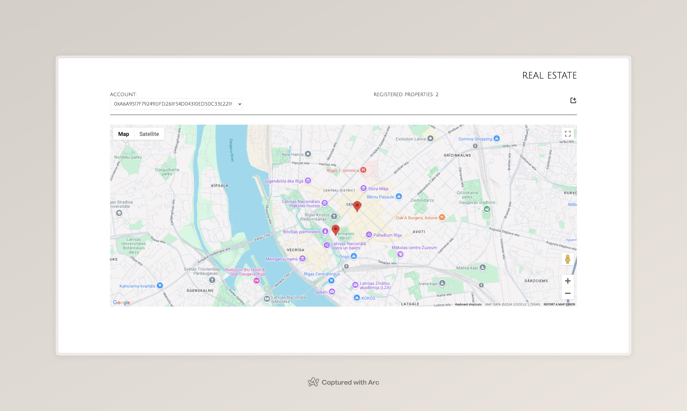

# Land Registry Smart Contract

This project implements a simple Land Registry system using Solidity. The smart contract allows users to register properties, transfer ownership, buy properties, and change listing statuses. The contract tracks properties by their unique IDs, and events are emitted to log significant actions such as ownership transfers, property purchases, and listing status changes.

  <!-- Replace this with your actual project image -->

## Features

- **Add Property**: Allows users to register new properties with a unique ID, including details like city, district, street, square meters, and price.
- **Transfer Ownership**: Allows the current owner of a property to transfer ownership to a new owner.
- **Buy Property**: Allows users to purchase properties if the conditions are met (sufficient funds, active listing, and registration).
- **Change Listing Status**: Allows the owner to toggle the listing status of a property between active and inactive.
- **Events**: Emits events for ownership transfers, property purchases, and listing status changes to track actions on the blockchain.
- **Geolocation with Google Maps**: The app uses Google Maps and Google Geocoding APIs to find coordinates for property addresses. These coordinates are used to display location pins on a map, showing available properties.

## Getting Started

### Technologies Used

 - **Solidity**: For writing Ethereum smart contracts.
 - **React**: For building the frontend application.
 - **Web3.js**: For interacting with Ethereum from the React app.
 - **Google Maps API**: To display property locations on the map.
 - **Google Geocoding API**: To convert property addresses into geolocation coordinates.

### Prerequisites

To deploy and interact with this smart contract, you need the following:

- [Node.js](https://nodejs.org/) (for JavaScript and npm)
- [Solidity](https://soliditylang.org/) version 0.8.0 or higher
- [Truffle](https://www.trufflesuite.com/truffle) or [Hardhat](https://hardhat.org/) (for local blockchain development)

### Installation

1. Clone the repository:
   ```bash
   git clone https://github.com/yourusername/land-registry.git
   cd land-registry
2. Install dependencies:
   ```bash
   npm install
3. Set up your local development blockchain (e.g., Ganache or Hardhat Network):
   ```bash
   npx ganache-cli
4. Deploy the contract to your local blockchain:
   ```bash
   npx truffle migrate --network development
   
### Usage

1. Add Property
    ```bash
   const landRegistry = await LandRegistryTest.deployed();
    await landRegistry.addProperty("New York", "Manhattan", "5th Avenue", 200, 5);
2. Buy Property
    ```bash
   await landRegistry.buyProperty(1, { value: web3.utils.toWei('5', 'ether') });
3. Transfer Ownership
    ```bash
   await landRegistry.transferOwnership(1, "0xCurrentOwnerAddress", "0xNewOwnerAddress");
4. Change Listing Status
    ```bash
    await landRegistry.changeListingStatus(1);
   
### Events

 - **OwnershipTransferred**: Emitted when ownership is transferred between two addresses.
 - **PropertyPurchased**: Emitted when a property is purchased, with the buyer's address and price.
 - **ListingStatusChanged**: Emitted when the listing status of a property is changed (active/inactive).
